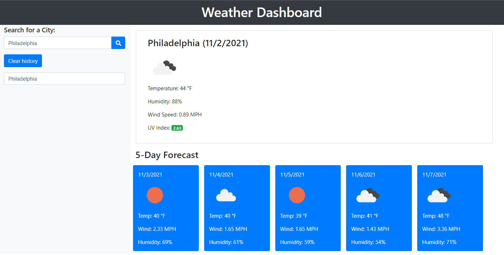

#Weather Dashboard Challenge

Description

The Weather Dashboard was created in order to allow the user to view the current and projected weather forecasts for selected cities over the course of several days. The user has the ability to enter a city name and search, which then displays the current and future weather conditions for that city, as well as stores the past searches. A variety of meteorological information is displayed ranging from temperature to wind speed and UV index. UV index is also reflected based on color relating to favorable, moderate, or severe conditions. Potential future enhancements include extending the 5-day forecast to a 10-day forecase, as well as including weather information from past years. 

Screenshot

 

Links
<ul>
    <li>
    Deployed application: https://lkalicki.github.io/weather-dashboard
    </li>
    <li>
    GitHub Repository: https://github.com/lkalicki/weather-dashboard
    </li>
</ul>